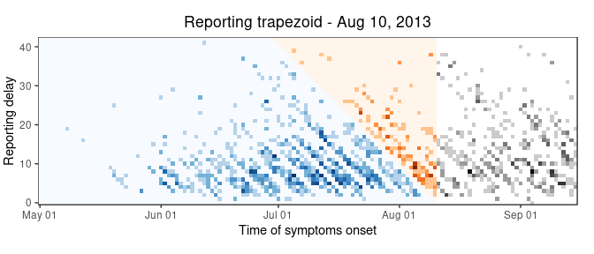
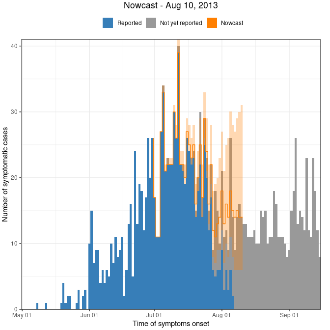
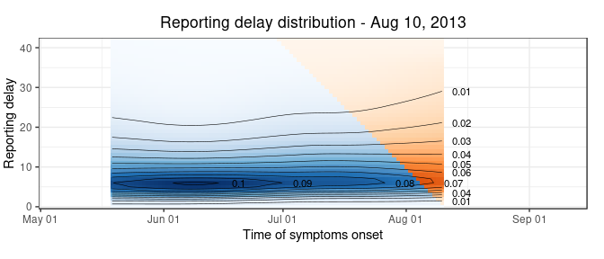

Nowcasting the number of new symptomatic cases during infectious disease
outbreaks using constrained P-spline smoothing
================
Jan van de Kassteele, Paul Eilers, Jacco Wallinga

## About this repository

Here you can download R code and example data to reproduce the results
from the paper **Nowcasting the number of new symptomatic cases during
infectious disease outbreaks using constrained P-spline smoothing** by
Jan van de Kassteele, Paul Eilers and Jacco Wallinga. The paper is
currently under review for
[Epidemiology](https://journals.lww.com/epidem/pages/default.aspx).

Below is a worked example. We produce a nowcast for Augst 10, 2013, just
after the peak of a large Measles outbreak in the Netherlands in
2013-2014.

## Worked example

Step one is to download or clone this repository to your local hard
drive. Then you can run the code step by step, while we explain what is
happening.

### Initial settings

This part is actually in `02 - initial settings.R`. Therefore you may
want to source this script directly into your workspace.

We start with loading some R packages. We need the `Matrix` package to
speed up the matrix computations. We use the `tidyverse` package for
data handling and visualisation. We enhance the functionality of the
`ggplot2` package, part of the tidyverse, by the `scales` package.
Finally, we need the `RColorBrewer` package to select some nice colors
from.

``` r
# Load packages
library(Matrix)
library(tidyverse)
library(scales)
library(RColorBrewer)
```

To be sure we have English date notation troughout our exercise, we set
the locate to English. This differs between Windows and Linux platforms.

``` r
# Set time locale to English for English day and month names
if (Sys.info()["sysname"] == "Windows") {
  # Windows
  Sys.setlocale(category = "LC_TIME", locale = "English")
} else {
  # Linux
  Sys.setlocale(category = "LC_TIME", locale = "en_US.UTF-8")
}
```

    [1] "en_US.UTF-8"

We now source the functions we need. These are all in de `functions`
folder. We use the `walk` function to source each function. See
`help(walk)`.

``` r
# Source functions
list.files(path = "functions", full.names = TRUE) %>% 
  walk(source)
```

Finally, we set some colors and palettes

``` r
# Set colors
blue <- brewer.pal(n = 9, name = "Set1")[2]
oran <- brewer.pal(n = 9, name = "Set1")[5]
grey <- brewer.pal(n = 9, name = "Set1")[9]

# Set color palettes
blue.pal <- brewer.pal(n = 9, name = "Blues")   %>% colorRampPalette
oran.pal <- brewer.pal(n = 9, name = "Oranges") %>% colorRampPalette
grey.pal <- brewer.pal(n = 9, name = "Greys")   %>% colorRampPalette
```

### Getting the data ready

Most of the steps below can be found in the script `03 - nowcasting one
single day.R`.

To produce a nowcast, we need a dataframe with two colums: `onset.date`
and `report.data`, both a `Date` class in R. Here we have a file
`measles_NL_2013_2014.dat`, already having these two columns. You will
find it in the `data` folder.

``` r
# Read pre-processed epidata
epi.data <- read.delim(file = "data/measles_NL_2013_2014.dat") %>% 
  # Make sure onset.date and report.date a Date class (was factor)
  mutate(
    onset.date  = onset.date  %>% as.Date,
    report.date = report.date %>% as.Date)

# Show the first six records of it
head(epi.data)
```

``` 
  onset.date report.date
1 2013-05-08  2013-05-27
2 2013-05-12  2013-05-28
3 2013-05-19  2013-05-28
4 2013-05-20  2013-05-27
5 2013-05-20  2013-05-27
6 2013-05-20  2013-05-28
```

### Model setup

Here we are specifying a prior reporting delay distribution, set the
starting date, ending date and nowcast date. We then pre-process the
data (i.e. create the reporting trapezoid) and set the nowcasting model
parameters.

#### Prior delay distribution

The prior delay distribution is a vector with a probability mass for
each delay (in days). The vector should add up to one. We use the
function `genPriorDelayDist` for this. We have to specify a mean delay
and maximum delay where we can expect that, say 99%, of all cases have
been reported. The function translates these numbers into a Negative
Binomial PMF.

As in the paper, for the measles outbreak, we set the prior mean
reporting delay to 12 days and the maximum reporting delay to 6 weeks
(42 days), where 99% of the cases will be reported.

``` r
# Generete prior reporting delay distribution
f.priordelay <- genPriorDelayDist(mean.delay = 12, max.delay = 42, p = 0.99)

# Check that is adds up to one
sum(f.priordelay)
```

    [1] 1

``` r
# Plot prior reporting delay PMF
ggplot(mapping = aes(
  x = seq_along(f.priordelay) - 1,
  y = f.priordelay)) +
  geom_col(fill = grey) +
  labs(x = "Reporting delay", y = "Probability mass") +
  theme_bw()
```

<!-- -->

Note that we implicity assume that at the starting date only one case is
expected. If you expect more cases, say 20, then multiply `f.priordelay`
with this number. `f.priordelay` should then add up to 20.

#### Data setup

In this step we create a dataframe with the number of cross-tabulated
cases and many other
things:

| Name       | Descrition                                                                        |
| :--------- | :-------------------------------------------------------------------------------- |
| `Date`     | Symptoms onset time                                                               |
| `Delay`    | Reporting delay (days)                                                            |
| `t`        | Integer showing the symptoms onset time since the starting date                   |
| `d`        | Integer showing the reporting delay (days)                                        |
| `Reported` | Factor with levels: “Reported”, “Not yet reported” and, retrospectively, “Future” |
| `Day`      | Factor with day of the week                                                       |
| `Cases`    | Number of cases                                                                   |
| `Est`      | Include record in estimation procedure (1 = yes, 0 = no)                          |
| `b`        | Boundary constraint indicator (1 = active, 0 = not active)                        |
| `g`        | Boundary constraint, log(reporting intensity)                                     |

For this we use the `dataSetup` function. We have to specify the
dataframe with the `onset.date` and `report.data`, the start date, end
date (only needed for plotting), and nowcast date. Furthermore, specify
the number of days back from the nowcast date to include in the
estimation procedure. Default is it twice the maximum delay, here
`2*42`. Finally, we include the prior reporing delay PMF.

``` r
# Data setup
rep.data <- dataSetup(
  data         = epi.data,
  start.date   = as.Date("2013-05-01"), # Starting date of outbreak
  end.date     = as.Date("2013-09-15"), # Ending date of outbreak (in real-time, leave NULL so end.date = nowcast.date)
  nowcast.date = as.Date("2013-08-10"), # Nowcast date
  days.back    = 2*42,                  # Number of days back from nowcast.date to include in estimation procedure
  f.priordelay = f.priordelay)          # Prior reporting delay PMF

# It looks like this
head(rep.data)
```

``` 
        Date Delay t d Reported Day Cases Est b         g
1 2013-05-01     0 1 0 Reported Wed     0   0 1 -3.938064
2 2013-05-02     0 2 0 Reported Thu     0   0 0  0.000000
3 2013-05-03     0 3 0 Reported Fri     0   0 0  0.000000
4 2013-05-04     0 4 0 Reported Sat     0   0 0  0.000000
5 2013-05-05     0 5 0 Reported Sun     0   0 0  0.000000
6 2013-05-06     0 6 0 Reported Mon     0   0 0  0.000000
```

We can plot these data using the `plotEpicurve` and `plotTrapezoid`
functions. The first shows the epidemic curve, the second the underlying
reporting trapezoid.

``` r
plotEpicurve(data = rep.data)
```

<!-- -->

``` r
plotTrapezoid(data = rep.data)
```

<!-- -->

In top figure we see daily number of symptomatic cases during the
Measles outbreak in the Netherlands for the period May 1 – September 15,
2013, as available in retrospect. We see that the number of reported
symptomatic cases (blue) drops to zero if we get closer to August 10,
2013, our nowcast date. The orange colors are the not yet reported
symptomatic cases on August 10, 2013, grey colors: cases without
symptoms (future). Again, only known in retrospect.

The bottom figure shows the corresponding reporting trapezoid (blue).
Day-of-the-week effects can be seen as diagonal patterns running trough
the figure. Hardly any cases are beging reported during weekends.

Our goal is to produce an estimate of the total number of symptomatic
cases on August 10, 2013, and the days before, until 42 days back. For
this, we need to extrapolate the reported cases in the blue trapezoid
into the orange triangle.

#### Model setup

We use a statistical model based on P-spline smoothing. P-splines
provide a flexible way of smoothing data, i.e. curve fitting,, and
extapolating this curve. In fact, we are fitting a surface as we are
deling with 2D data.

One feature of extrapolating with P-splines is the difference order of
the adjacent coefficients. If we take second order differences
(default), a curve will be extrapolated linearly. If we take first order
differences, a curve will be extrapolated as a constant. So, it is of
importance here to make a correct choice.

The function `modelSetup` has an argument `ord` (default `ord = 2`).
Here we can choose between linear and constant extrapolation in the
direction of calendar time. In the delay direction we always take second
order differences.

In order to produce a stable extrapolation, we need additional
constraints. These are set or unset using several kappa values. Here we
use de default values. We refer to our paper for their meaning.

``` r
# Model setup
model.setup <- modelSetup(
  data = rep.data,
  ord = 2,
  kappa = list(u = 1e6, b = 1e6, w = 0.01, s = 1e-6))
```

#### Nowcast

The last step is the nowcast. For this we use the `nowcast` function and
here all the magic happens. A surface is fitted to the reported counts,
taking into account the day-of-the-week effects. Next, this surface is
extrapolated and the reported and estimated cases are summed by date.

``` r
# Nowcast
nowcast.list <- nowcast(
  data = rep.data,
  model = model.setup,
  conf.level = 0.90)
```

The `nowcast` function produces a list with three objects: a dataframe
called `nowcast`. Here it has 84 rows (2\*42), and four columns: `Date`,
`med`, `lwr` and `upr`. This is the nowcast for each date with a 90%
prediction interval. The second object is a list called `F.nowcast` of
length 84. This the the empirical cumulative distribution function
(ecdf) of the nowcasts by date. We can use this to evaluate the nowcast.
The thrid object is called `f.delay`. This is again a dataframe with a
smooth estimate of the reporting delay PMF by date.

Let’s have a look at `nowcast.list$nowcast`, because that is what we are
interested in.

``` r
# Show the last records of nowcast.list$nowcast
tail(nowcast.list$nowcast)
```

``` 
         Date med   lwr   upr
79 2013-08-05  18 11.00 30.05
80 2013-08-06  15  7.95 28.00
81 2013-08-07  14  6.00 27.00
82 2013-08-08  15  6.00 29.00
83 2013-08-09  14  6.00 30.00
84 2013-08-10  14  6.00 31.00
```

We can visualize the nowcast using the `plotNowcast` function.

``` r
# Plot the nowcast
plotNowcast(data = rep.data, nowcast = nowcast.list, title = "Nowcast")
```

<!-- -->

This is almost the same figure as the epicurve above. However, the
orange bars are replaced by an estimate of the number of symptomatic
cases (thick orange line). The shaded area is the 90% prediction
interval.

We can see the model does quite a good job, even no cases have been
reported near August 10.

#### Time varying reporing delay distribution

One last thing is the visualize the smooth estimate of the reporing
delay distribution. For this we use the `plotDelayDist`
function.

``` r
plotDelayDist(data = rep.data, nowcast = nowcast.list, title = "Reporting delay distribution")
```

<!-- -->

This conlcudes our worked example.

### Other things

Other things you might want to try is generating a series of nowcasts,
e.g. as an animation. Furthermore, you might want to investigate how
well the nowcast is, of course only known in retrospect. For this you
can have a look at the scripts `04 - nowcasting loop.R` and `05 -
nowcasting performance.R`
