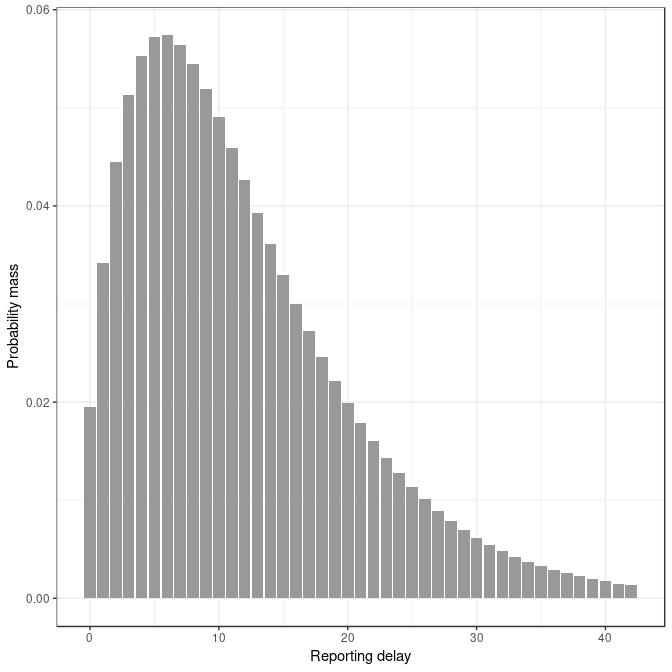
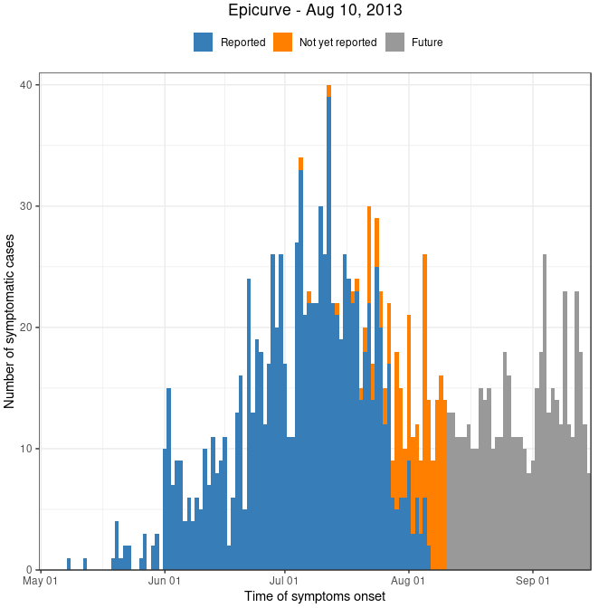
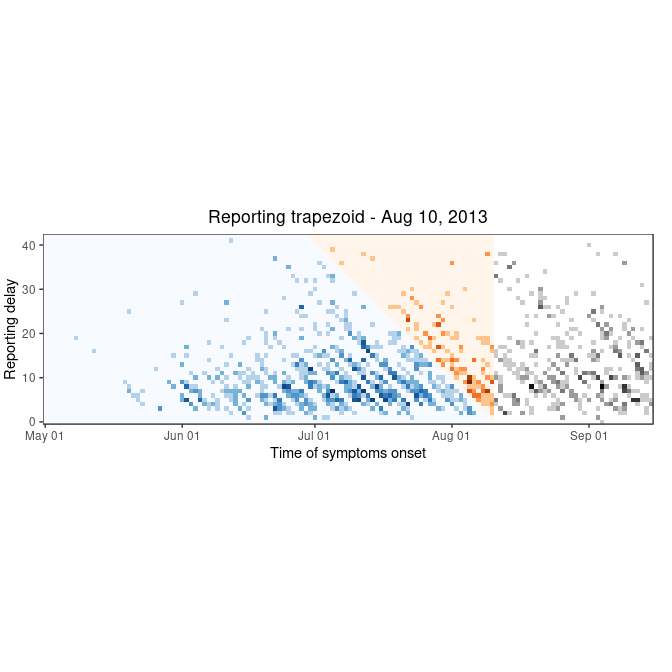

Nowcasting the number of new symptomatic cases during infectious disease
outbreaks using constrained P-spline smoothing
================
Jan van de Kassteele, Paul Eilers, Jacco Wallinga

## Worked example

Here we will show how to produce a nowcast for one single day during the
2013-2014 Measles outbreak in the Netherlands. The first thing you have
to do is download of clone this repository to your local hard drive.

### Initial settings

This part is actually in `02 - initial settings.R`. Therefore you may
want to source this script directly into your workspace.

We start with loading some R packages. We need the `Matrix` package to
speed up the matrix computations. We use `scales` and `gridExtra` to
enhance the functionality of `ggplot2`, part of the `tidyverse` package
for data handling. Finally, we use the `RColorBrewer` package to select
some nice colors from.

``` r
# Load packages
library(Matrix)
library(scales)
library(gridExtra)
library(tidyverse)
library(RColorBrewer)
```

To be sure we have English month notation troughout our exercise, we set
the locate to English. This differs between Windows and Linux platforms.

``` r
# Set time locale to English for English day and month names
if (Sys.info()["sysname"] == "Windows") {
  # Windows
  Sys.setlocale(category = "LC_TIME", locale = "English")
} else {
  # Linux
  Sys.setlocale(category = "LC_TIME", locale = "en_US.UTF-8")
}
```

    [1] "en_US.UTF-8"

We now source the functions we need. There are all in de `functions`
folder on this repository.

``` r
# Source functions
list.files(path = "functions", full.names = TRUE) %>% 
  walk(source)
```

Finally, we set some colors and palettes

``` r
# Set colors
blue <- brewer.pal(n = 9, name = "Set1")[2]
oran <- brewer.pal(n = 9, name = "Set1")[5]
grey <- brewer.pal(n = 9, name = "Set1")[9]

# Set color palettes
blue.pal <- brewer.pal(n = 9, name = "Blues")   %>% colorRampPalette
oran.pal <- brewer.pal(n = 9, name = "Oranges") %>% colorRampPalette
grey.pal <- brewer.pal(n = 9, name = "Greys")   %>% colorRampPalette
```

### Getting the data ready

To produce a nowcast, we need a dataframe with two colums: `onset.date`
and `report.data`, both a `Date` class in R. Here we already have a file
`measles_NL_2013_2014.dat`. You will find it in the `data` folder.

``` r
# Read pre-processed epidata
epi.data <- read.delim(file = "data/measles_NL_2013_2014.dat") %>% 
  # Make sure onset.date and report.date a Date class (was factor)
  mutate(
    onset.date  = onset.date  %>% as.Date,
    report.date = report.date %>% as.Date)

# Show the first six records of it
head(epi.data)
```

``` 
  onset.date report.date
1 2013-05-08  2013-05-27
2 2013-05-12  2013-05-28
3 2013-05-19  2013-05-28
4 2013-05-20  2013-05-27
5 2013-05-20  2013-05-27
6 2013-05-20  2013-05-28
```

### Model setup

Here we are specifying a prior reporting delay distribution, set the
starting date, ending date and nowcast date. We then pre-process the
data (i.e. create the reporing trapezoid) and set the nowcasting model
parameters.

#### Prior delay distribution

The prior delay distribution is a vector with a probability mass for
each delay. The vector should add up to one. We use the function
`genPriorDelayDist` for this. We have to specify a mean delay and
maximum delay where we can expect that, say 99%, of all cases have been
reported. It translates these numbers into a Negative Binomial
distribution.

For the measles outbreak, the prior mean reporting delay is 12 days and
the maximum reporting delay is 6 weeks (42 days), where 99% of all cases
have been reported.

``` r
# Generete prior reporting delay distribution
f.priordelay <- genPriorDelayDist(mean.delay = 12, max.delay = 42, p = 0.99)

# Some checks
sum(f.priordelay)
```

    [1] 1

``` r
# Plot prior reporting delay PMF
ggplot(mapping = aes(
  x = seq_along(f.priordelay) - 1,
  y = f.priordelay)) +
  geom_col(fill = grey) +
  labs(x = "Reporting delay", y = "Probability mass") +
  theme_bw()
```

<!-- -->

Note that we implicity assume that at the starting date only one case is
expected. If you expect more cases, say 20, then multiply `f.priordelay`
with this number.

#### Data setup

In this step we create a dataframe with the number of cross-tabulated
cases and many other
things:

| Name       | Descrition                                                                        |
| :--------- | :-------------------------------------------------------------------------------- |
| `Date`     | Symptoms onset time                                                               |
| `Delay`    | Reporting delay (days)                                                            |
| `t`        | Integer showing the symptoms onset time since the starting date                   |
| `d`        | Integer showing the reporting delay (days)                                        |
| `Reported` | Factor with levels: “Reported”, “Not yet reported” and, retrospectively, “Future” |
| `Day`      | Factor with day of the week                                                       |
| `Cases`    | Number of cases                                                                   |
| `Est`      | Include record in estimation procedure (1 = yes, 0 = no)                          |
| `b`        | Boundary constraint indicator (1 = active, 0 = not active)                        |
| `g`        | Boundary constraint, log(reporting intensity)                                     |

For this we use the `dataSetup` function. We have to specify the
dataframe with the `onset.date` and `report.data`, the start date, end
date, and nowcast date. Furthermore, specify the number of days back
from the nowcast date to include in the estimation procedure. Default is
it twice the maximum delay. Finally, include the prior reporing delay
PMF.

``` r
# Data setup
rep.data <- dataSetup(
  data         = epi.data,
  start.date   = as.Date("2013-05-01"), # Starting date of outbreak
  end.date     = as.Date("2013-09-15"), # Ending date of outbreak (in real-time, leave NULL so end.date = nowcast.date)
  nowcast.date = as.Date("2013-08-10"), # Nowcast date
  days.back    = 2*42,                  # Number of days back from nowcast.date to include in estimation procedure
  f.priordelay = f.priordelay)          # Prior reporting delay PMF

# It looks like this
head(rep.data)
```

``` 
        Date Delay t d Reported Day Cases Est b         g
1 2013-05-01     0 1 0 Reported Wed     0   0 1 -3.938064
2 2013-05-02     0 2 0 Reported Thu     0   0 0  0.000000
3 2013-05-03     0 3 0 Reported Fri     0   0 0  0.000000
4 2013-05-04     0 4 0 Reported Sat     0   0 0  0.000000
5 2013-05-05     0 5 0 Reported Sun     0   0 0  0.000000
6 2013-05-06     0 6 0 Reported Mon     0   0 0  0.000000
```

We can plot these data using the `plotEpicurve` and `plotTrapezoid`
functions. The first shows the epidemic curve, the second the underlying
reporting trapezoid.

``` r
plotEpicurve(data = rep.data)
```

<!-- -->

``` r
plotTrapezoid(data = rep.data)
```

<!-- -->
